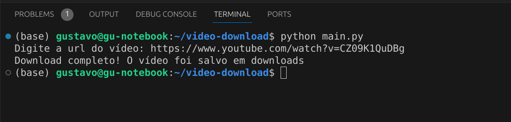
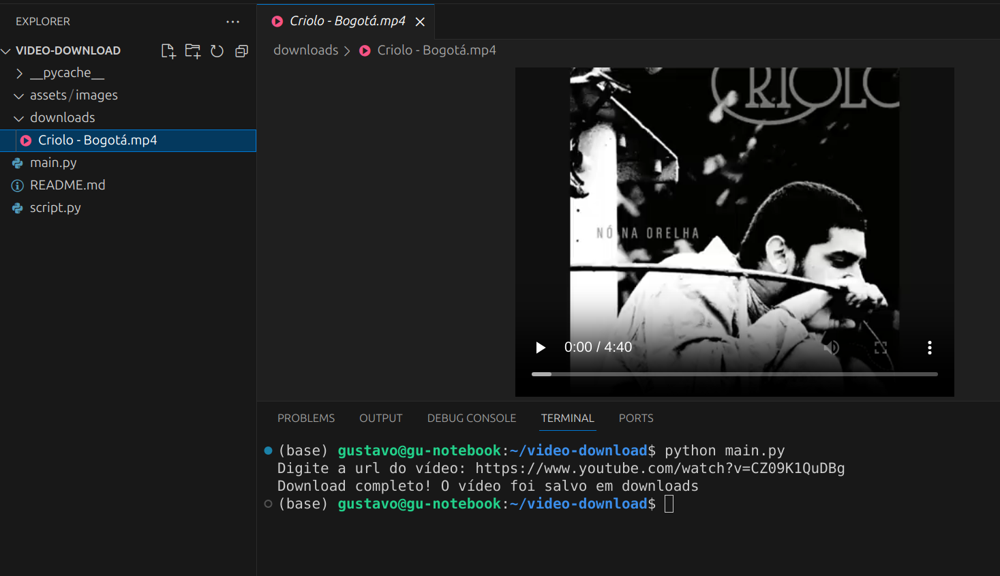

<h1> Downloader de vídeos</h1>

<p align="center">
  
  
</p>

## Descrição do projeto

<p align="justify">
  Script pessoal para efetuar o download de vídeos de forma prática e rápida
</p>

## Layout do script:

### Digite a url do vídeo que deseja instalar:


### Vídeo instalado:



## Como rodar a aplicação:

No terminal, clone o projeto:

```
git clone https://github.com/dias-gxstavo/video-downloader
```

Baixe a dependência necessária:

```
pip install pytubefix
```

## Como rodar os testes:

```
python main.py
```
